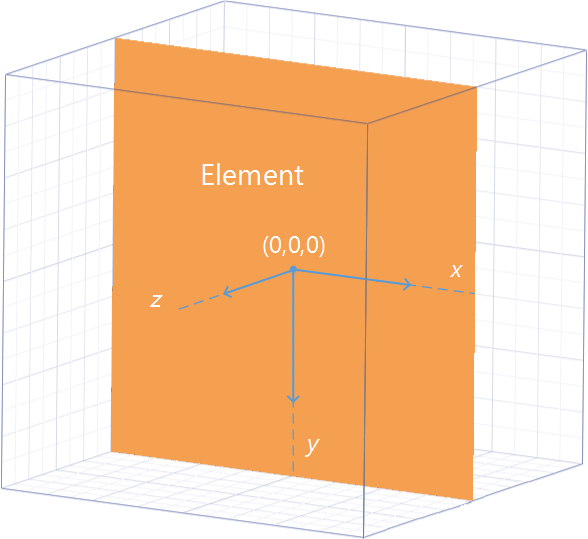

# CSS居中初级理解
## 想法
在工作刚开始的时候，对CSS还是很有热情的，也花了时间看了些相关的书籍，做了相关的尝试。随着工作经验积累，手上的事情也越来越多，大部分时候根据已有的经验快速解决问题。时间久了，知道怎么写出这个效果，但写的时候往往很少再去想一下，这个属性的具体作用。所以在此对经常使用的CSS属性“再想一下”。
## 约定
“再想一下”更多的是去理解规范标准，在这里就不会去比较它们的优劣，如果理解了这些，我想到时候自然知道如何去选择。CSS居中在设计和代码实现中用的很多，居中效果需要有一个参照物，下面CSS实现方法前提是，都有一个一定高度和宽度的父元素。
## 居中
经常遇到的居中效果主要有2种：水平居中和垂直居中。需要居中的元素高宽度可能有或没有，为了方便理解，先以有固定高宽度元素为例。html的结构如下：
```html
<div class="css-center-parent">
  <div class="css-center-rec"></div>
</div>
```
基本的属性如下：
```css
.css-center-parent {
  border: 1px solid #333;
  width: 300px;
  height: 185px;
}
.css-center-rec {
  border: 1px solid #333;
  width: 100px;
  height: 62px;
}
```
## 水平居中
#### 方法1：使用margin让元素居中
```css
.ma {
  margin: 0 auto;
}
```
margin是一个简写属性，上面的意思就是margin-top和margin-bottom值为0，margin-left和margin-right值为auto，可为什么左右值为auto就可以水平居中了？找文档走起，文档里面对取值为auto单独的有一个说明链接[calculating widths and margins](https://www.w3.org/TR/CSS22/visudet.html#Computing_widths_and_margins)，过去之后发现计算margin的值是跟其它的属性也有关系，按情况分有10种情况，这个例子是属于第3种情况：在正常文档流中的块级非替换元素。
> 3. block-level, non-replaced elements in normal flow  

相互影响的属性是有下面一个强制约定的关系：
> 'margin-left' + 'border-left-width' + 'padding-left' + 'width' + 'padding-right' + 'border-right-width' + 'margin-right' = width of containing block

下面说了好几种更详情的情况，这个例属于最后说明：如果margin-left和margin-right值都是auto，那么它们渲染出来的值就相等。所以这样使用margin就让元素居中了。

#### 方法2：改变居中元素display属性,父元素设置text-align: center;
```css
/* 添加到父元素上 */
.tc {
  text-align: center;
}
/* 添加到居中元素上 */
.dib {
display: inline-block;
}
```
在一些教程里面对text-align的解释是：指定元素文本的水平对齐方式。但这里是一个元素又不是文本，为什么就居中了？找文档走起，看了之后发现，这个感觉就是英文单词上的误导。这个属性描述的是块级元素里面内联级别内容如何对齐，并不是只针对文本。
> This property describes how inline-level content of a block container is aligned. 

元素设置了display: inline-block后也有了内联元素的特性，text-align也就生效了，所以就让元素居中了。

#### 方法3：居中元素使用定位position和margin负值
```css
/* 添加到父元素上 */
.pr {
  position: relative;
}
/* 添加到居中元素上 */
.css-center-rec-pos-justify1 {
  position: absolute;
  left: 50%;
  margin-left: -50px;
}
```
这个主要是要理解属性的具体作用。找文档走起，首先，margin是可以为负值，不过可以有一些特定于具体实现的限制。
> Negative values for margin properties are allowed, but there may be implementation-specific limits.       

设置margin为负值，效果就是超过了父元素的边框，这里居中元素会向左超出50px。然后设置了居中元素position绝对定位（不一定要绝对定位），left属性含义是：该元素的左外边距边界相对于其包含块左边界有多远。值为百分比时，计算相对于其包含块的宽度计算，这里居中元素向右偏移了150px。最终距离父元素左边界150-50=100px，父元素300px,居中元素100px，该元素就居中了。

#### 方法4：居中元素使用定位position和transform
```css
/* 添加到父元素上 */
.pr {
  position: relative;
}
/* 添加到居中元素上 */
.css-center-rec-pos-justify1 {
  position: absolute;
  left: 50%;
  transform: translateX(-50%);
}
```
这个主要是要理解属性的具体作用。position定位在方法3中提过，至于transform这个属性,找文档走起。虽然还没有正式成为标准，但大部分浏览器都已经支持了，transform属性会让这个元素建立自己的坐标系，在坐标系里面可以改变形状，大小和位置。



元素坐标系的原点默认是元素的中心，translateX就是元素中心沿着坐标系X轴移动，值为百分数的时候，计算值是相对于元素自身的宽度。position定位向右偏移了300*50%=150px，元素自身transform向左偏移了100 * 50%=50px，最终距离父元素左边界150-50=100px，父元素300px,居中元素100px，该元素就居中了。更多相关点击[这里](https://www.w3.org/TR/css-transforms-1/)。

#### 方法5：使用flex
```css
/* 添加到父元素上 */
.df {
  display: flex;
}
.css-center-parent-flex-justify {
  justify-content: center;
}
```
这个主要也是理解属性的具体作用。在CSS2.1中定义了4种布局模式：block layout、inline layout、table layout、positioned layout。这种方法使用的是新的一种布局模型:flex layout,它是为复杂的应用程序和网页设计。flex布局模式主要由父容器和它直接的子元素组成，父容器被成为flex container，其直接子元素被称为flex items。      
代码中父元素设置display:flex，让它成为了flex container，其直接子元素的排列就使用flex布局模式。在CSS中定义了一些跟物理方向和空间相对应的一些概念，这些概念为未来定义新的布局提供理论的支持，在flex布局模式中对应物理方向和空间的概念如下如下图。


父元素设置justify-content属性表示的是flex items在main axis上的对其方式，其属性值center表示在main axis上居中，其直接子元素就居中了。更多相关点击[这里](https://www.w3.org/TR/css-flexbox-1/#justify-content-property)。


       
## 参考文档：
1. Alignment: the 'text-align' property：https://www.w3.org/TR/CSS2/text.html#propdef-text-align
2. Box dimensions：https://www.w3.org/TR/CSS2/box.html#box-margin-area
3. Box offsets: 'top', 'right', 'bottom', 'left'：https://www.w3.org/TR/CSS2/visuren.html#propdef-left
4. CSS Transforms Module Level 1：https://www.w3.org/TR/css-transforms-1/
5. Containing blocks（包含块）：https://www.w3.org/TR/CSS2/visuren.html#containing-block
6. Bring your page to life with CSS transforms：https://msdn.microsoft.com/en-us/library/jj665791(v=vs.85).aspx
7. CSS Flexible Box Layout Module Level 1：https://www.w3.org/TR/css-flexbox-1/#justify-content-property
8. Abstract Box Terminology：https://www.w3.org/TR/css-writing-modes-3/#abstract-box


