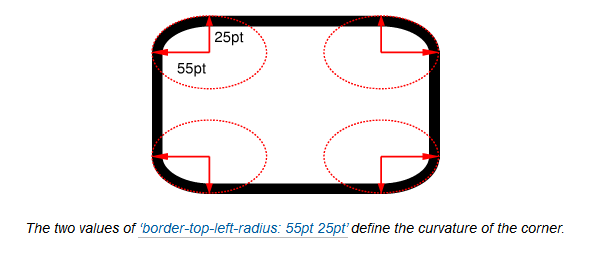

# CSS形状初级理解
## 想法
在工作的时候，会听到一些说法，比如“这个很简单，网上直接搜，然后复制粘贴一下”、“网上有直接可以拿来用的，何必自己费力去写”，现在想想就是这样的原因，导致一些最初本来理解的东西，不经思考粘贴复制久了，都慢慢淡忘了。在用CSS的过程中体会尤为明显，印象最深的是用CSS想写一些形状的时候，都要先网上搜一下,我感到不爽很久了，现在才决定花时间重新整理一下，惭愧惭愧。
## 约定
以下形状都是只用一个html标签，未考虑兼容性，建议在Google Chrome浏览器中浏览。使用html标签结构如下：
```html
<div></div>
```
样式重置中使用了box-sizing:border-box，这个对一些形状实现有影响。
## 形状
#### 正方形
```css
.example-square {
  width: 100px;
  height: 100px;
  background-color: #333;
}
```
这种宽度和高度相等就可以了。
#### 长方形
```css
.example-rectangle {
  width: 200px;
  height: 100px;
  background-color: #333;
}
```
这种宽度和高度不相等就可以了。
#### 正圆
```css
.example-circle {
  width: 100px;
  height: 100px;
  border-radius: 50%;
  background-color: #333;
}
```
这个是使用了圆形边角属性：border-radius，是border-top-left-radius、border-top-right-radius、border-bottom-right-radius、border-bottom-left-radius缩写形式，它的作用是对元素的border box进行切圆角处理，如下图：



**值的形式为**   
<length-percentage>{1,2}  
第一个值是切圆水平半径，第二个值是垂直半径，如果第二个值省略，将会复制使用第一个值。  
**取值**    
其值可以为绝对值或百分比，初始值为0，百分比时,第一个值参考的是元素border box的宽度（width），第二个值参考的是元素border box的宽度（height）,不能为负值。  
缩写形式的取值跟border的格式类似，具体可参考：https://developer.mozilla.org/en-US/docs/Web/CSS/border-radius

在示例中border-radius:50%的含义是这个元素的四个边角的切圆半径为100 * 50% = 50px,就是正圆的1/4，剩下的正好形成了一个正圆。
#### 椭圆
```css
.example-oval {
  width: 200px;
  height: 100px;
  background-color: #333;
  border-radius: 100px/50px;
}
```
这个也是使用了border-radius，其值相当于：
```css
{
  border-top-left-radius:     100px 50px;
  border-top-right-radius:    100px 50px;
  border-bottom-right-radius: 100px 50px;
  border-bottom-left-radius:  100px 50px;
}

```
#### 三角形
1. 上三角
```css
.example-triangle-up {
  width: 100px;
  height: 100px;
  border-left: 50px solid transparent;
  border-right: 50px solid transparent;
  border-bottom: 100px solid #333;
}
```
2. 下三角
```css
.example-triangle-down {
  width: 100px;
  height: 100px;
  border-left: 50px solid transparent;
  border-right: 50px solid transparent;
  border-top: 100px solid #333;
}
```
3. 右三角
```css
.example-triangle-right {
  width: 100px;
  height: 100px;
  border-top: 50px solid transparent;
  border-bottom: 50px solid transparent;
  border-left: 100px solid #333;
}
```
4. 左三角
```css
.example-triangle-left {
  width: 100px;
  height: 100px;
  border-top: 50px solid transparent;
  border-bottom: 50px solid transparent;
  border-right: 100px solid #333;
}
```

参考：
- https://developer.mozilla.org/zh-CN/docs/Web/CSS/border-radius
- https://drafts.csswg.org/css-backgrounds-3/#border-radius
- https://www.zhihu.com/question/35180018
- https://css-tricks.com/examples/ShapesOfCSS/

