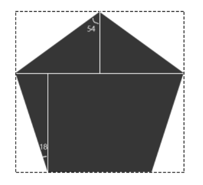
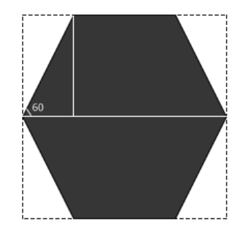
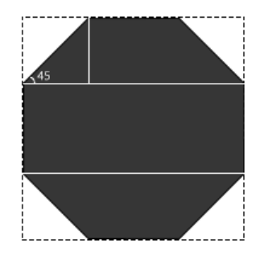
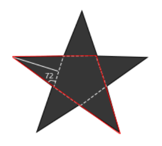
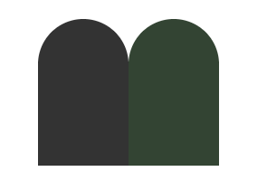
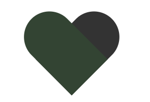

# CSS常见形状实现思路
## 想法
在[CSS形状初级理解](https://github.com/XXHolic/blog/issues/6)中对基本的形状实现作了简单分析后，在工作之余尝试了下其它的形状，发现还是要花不少的心思，在此总结记录一下，巩固的同时方便以后查阅。
## 约定
以下形状都是只用一个html标签，未考虑兼容性，建议在Google Chrome浏览器中浏览。使用html标签结构如下：
```html
<div></div>
```
样式重置中使用了box-sizing:border-box，这个对一些形状实现有影响。

以下方法示例页面：[CSS常见形状实现思路示例](https://xxholic.github.io/lab/lab-css/css-shape.html)
## 形状
### 梯形
利用border属性的特性，设置一个矩形的3条边，其中2条的颜色变为透明，一条边设置为需要的颜色即可。
```css
.example-trapezoid {
  width: 200px;
  height: 0;
  border-left: 50px solid transparent;
  border-right: 50px solid transparent;
  border-bottom: 100px solid #333;
}
```
用2个跟底色相同颜色的直角三角形，盖矩形的两边，三角形用伪元素写。见[示例](https://xxholic.github.io/lab/lab-css/css-shape-other.html)。
### 平行四边形
使用transform属性
```css
.example-parallelogram1 {
  width: 200px;
  height: 100px;
  transform: skew(-10deg);
  background-color: #333;
}
```
用2个跟底色相同颜色的直角三角形，覆盖矩形的两边，三角形用伪元素写。
```css
.example-parallelogram2 {
  position: relative;
  width: 200px;
  height: 100px;
  background-color: #333;
}
.example-parallelogram2:before {
  content: '';
  position: absolute;
  top: 0;
  left: 0;
  border-right: 20px solid transparent;
  border-top: 100px solid #fff;
}
.example-parallelogram2:after {
  content: '';
  position: absolute;
  top: 0;
  right: 0;
  border-left: 20px solid transparent;
  border-bottom: 100px solid #fff;
}
```
### 菱形
用2个等腰三角形拼在一起，至少要用一个伪元素。
```css
.example-diamond {
  position: relative;
  width: 200px;
  height: 100px;
  background-color: #333;
}
.example-diamond:before {
  content: "";
  position: absolute;
  top: 0;
  left: 0;
  border-right: 100px solid transparent;
  border-top: 50px solid #fff;
  border-bottom: 50px solid #fff;
}
.example-diamond:after {
  content: "";
  position: absolute;
  top: 0;
  right: 0;
  border-left: 100px solid transparent;
  border-top: 50px solid #fff;
  border-bottom: 50px solid #fff;
}
```
### 正五边形
随便一个五边形的话，还是比较好弄，正五边形就不太一样了，需要一些基本的计算。实现的思路用一个等腰三角形和一个等腰梯形组合。三角形和梯形用在一个矩形内，设置border的方式实现，所以要先算出这两个图形所在矩形的高宽度。  



```javascript
// 正五边形的边长长度
var pentagonBorderLen = 100;
/*
* triangleRecHeight,triangleRecWidth  三角形所在矩形的高宽度
* triangleRecLeftWidth  CSS写三角形时左右边框的宽度
* trapezoidRecHeight,trapezoidRecWidth  梯形所在矩形的高宽度
* trapezoidRecLeftBorderWidth   CSS写梯形时左右边框的宽度
*/
var triangleRecHeight,triangleRecWidth,triangleRecLeftWidth,trapezoidRecHeight,trapezoidRecWidth,trapezoidRecLeftBorderWidth;
// 正五边形是轴对称图形，每个内角是108deg，所以做简单的辅助线后就可以计算出对应矩形的高宽度
triangleRecHeight = pentagonBorderLen * Math.cos(54);
triangleRecWidth = pentagonBorderLen * Math.sin(54) * 2;
triangleRecLeftWidth = triangleRecWidth / 2;

trapezoidRecHeight = pentagonBorderLen * Math.cos(18);
trapezoidRecWidth = pentagonBorderLen * Math.sin(54) * 2;
trapezoidRecLeftBorderWidth = pentagonBorderLen * Math.sin(18);
```
根据以上计算取约数后，样式为：
```css
.example-pentagon {
  position: relative;
  width: 162px;
  height: 154px;
}
.example-pentagon:before {
  content: '';
  position: absolute;
  left: 0;
  top: 0;
  border-bottom: 59px solid #333;
  border-left: 81px solid transparent;
  border-right: 81px solid transparent;
}
.example-pentagon:after {
  content: '';
  position: absolute;
  left: 0;
  bottom: 0;
  box-sizing: border-box;
  width: 162px;
  border-top: 95px solid #333;
  border-left: 31px solid transparent;
  border-right: 31px solid transparent;
}
```
视觉上还是过得去的。还可以将正五边形分成3个三角形，这个就更麻烦一些。
### 正六边形
正六边形可以用2个全等的等腰梯形组合形成。也是需要简单的计算。



```javascript
// 正六边形的边长长度
var hexagonBorderLen = 100;
/*
* trapezoidRecHeight,trapezoidRecWidth  梯形所在矩形的高宽度
* trapezoidRecLeftBorderWidth   CSS写梯形时左右边框的宽度
*/
var trapezoidRecHeight,trapezoidRecWidth,trapezoidRecLeftBorderWidth;
// 正六边形是轴对称图形，每个内角是120deg，所以做简单的辅助线后就可以计算出对应矩形的高宽度
trapezoidRecHeight = hexagonBorderLen * Math.sin(60);
trapezoidRecWidth = hexagonBorderLen * 2;
trapezoidRecLeftBorderWidth = hexagonBorderLen * Math.cos(60);
```
计算后四舍五入，得到样式为：
```css
.example-hexagon {
  position: relative;
  width: 200px;
  height: 174px;
}
.example-hexagon:before {
  content: '';
  position: absolute;
  left: 0;
  top: 0;
  box-sizing: border-box;
  width: 200px;
  border-bottom: 87px solid #333;
  border-left: 50px solid transparent;
  border-right: 50px solid transparent;
}
.example-hexagon:after {
  content: '';
  position: absolute;
  left: 0;
  bottom: 0;
  box-sizing: border-box;
  width: 200px;
  border-top: 87px solid #333;
  border-left: 50px solid transparent;
  border-right: 50px solid transparent;
}
```
还可以分成一个矩形和2个三角形，较复杂。
### 正八边形
正八边形可以用2个全等的等腰梯形和一个矩形组合形成，需要简单的计算。


```javascript
// 正八边形的边长长度
var octagonBorderLen = 60;
/*
* trapezoidRecHeight,trapezoidRecWidth  梯形所在矩形的高宽度
* trapezoidRecLeftBorderWidth   CSS写梯形时左右边框的宽度
*/
var trapezoidRecHeight,trapezoidRecWidth,trapezoidRecLeftBorderWidth;
// 正八边形是轴对称图形，每个内角是135deg，所以做简单的辅助线后就可以计算出对应矩形的高宽度
trapezoidRecHeight = octagonBorderLen * Math.sin(45);
trapezoidRecWidth = octagonBorderLen + octagonBorderLen * Math.cos(45) * 2;
trapezoidRecLeftBorderWidth = octagonBorderLen * Math.cos(45);
```
计算后四舍五入，得到样式为：
```css
.example-octagon {
  position: relative;
  margin: 58px 0;
  width: 145px;
  height: 60px;
  background-color: #333;
}
.example-octagon:before {
  content: '';
  position: absolute;
  left: 0;
  top: -42px;
  box-sizing: border-box;
  width: 145px;
  border-bottom: 42px solid #333;
  border-left: 42px solid transparent;
  border-right: 42px solid transparent;
}
.example-octagon:after {
  content: '';
  position: absolute;
  left: 0;
  bottom: -42px;
  box-sizing: border-box;
  width: 145px;
  border-top: 42px solid #333;
  border-left: 42px solid transparent;
  border-right: 42px solid transparent;
}
```
### 五角星
五角星可以看成是2个不同大小三角形旋转组合形成，如果是不规则的五角星，用试的方法很麻烦，这里的五角星是通过正五边形各个边延长，交汇形成的五角星。这样子就可以用公式算出对应设置的值。



如图，由红三角和其对称图形，再加上顶部的一个小三角形组合就可以了。可以根据正五边形的边长计算出三角形所在矩形的宽高属性值。
```javascript
// 正五边形的边长长度
var pentagonBorderLen = 100;
/*
* smallTriangleRecHeight,smallTriangleRecWidth  小三角形所在矩形的高宽度
* smallTriangleRecLeftBorderWidth   CSS写小三角形时左右边框的宽度
* bigTriangleRecHeight,bigTriangleRecWidth  大三角形所在矩形的高宽度
* bigTriangleRecLeftBorderWidth   CSS写大三角形时左右边框的宽度
*/
var smallTriangleRecHeight,smallTriangleRecWidth,smallTriangleRecLeftBorderWidth,bigTriangleRecHeight,bigTriangleRecWidth,bigTriangleRecLeftBorderWidth;

smallTriangleRecHeight = (pentagonBorderLen/2) * Math.tan(72);
smallTriangleRecWidth = pentagonBorderLen;
smallTriangleRecLeftBorderWidth = pentagonBorderLen/2;

bigTriangleRecHeight = pentagonBorderLen * Math.cos(45) + pentagonBorderLen * Math.cos(18);
bigTriangleRecWidth = pentagonBorderLen * (1 + 1/Math.cos(72));
```
计算后四舍五入，CSS如下：
```css
/* 用了scale缩放是因为取值太大了,并没有实际作用 */
.example-star-five {
  position: relative;
  width: 424px;
  height: 154px;
  border-bottom: 154px solid #333;
  border-left: 212px solid transparent;
  border-right: 212px solid transparent;
  transform: rotate(36deg) scale(.5);
}
.example-star-five:before {
  position: absolute;
  content: '';
  top: 0;
  left: -212px;
  border-bottom: 154px solid #333;
  border-left: 212px solid transparent;
  border-right: 212px solid transparent;
  transform: rotate(-72deg);
}
.example-star-five:after {
  position: absolute;
  content: '';
  top: -109px;
  left: -135px;
  border-bottom: 154px solid #333;
  border-left: 50px solid transparent;
  border-right: 50px solid transparent;
  transform: rotate(-36deg);
}
```
这里有2个点是需要注意：
- 旋转的角度正好是五角星一个角的度数36deg，其对称的图形只需要反向旋转72deg；
- 最后小三角形的位移也是可以用数学公式算出来，但由于个人数学不好，公式没弄出来，用值试的时候最好在只要一个大三角和一个小三角的时候尝试，这样还是可以接受的。
### 六角星
如果是不规则的六角星，随意两个三角形重叠就可以了。这里介绍的是由正六边形各个边延伸，交汇形成的六角星，这样形成的六角星由两个全等的等边三角形重叠就可以了。
```javascript
// 正六边形的边长长度
var hexagonBorderLen = 60;
/*
* TriangleRecHeight,TriangleRecWidth  三角形所在矩形的高宽度
* TriangleRecLeftBorderWidth   CSS写三角形时左右边框的宽度
* moveTopLen  重叠移动的距离
*/
var TriangleRecHeight,TriangleRecWidth,TriangleRecLeftBorderWidth,moveTopLen;
TriangleRecWidth = hexagonBorderLen * 3;
TriangleRecHeight = TriangleRecWidth * Math.sin(60);
TriangleRecLeftBorderWidth = TriangleRecWidth/2;
moveTopLen = hexagonBorderLen * Math.sin(60);
```
计算后四舍五入，css如下：
```css
.example-star-six {
  position: relative;
  margin-bottom: 68px;
  width: 180px;
  height: 156px;
  border-bottom: 156px solid #333;
  border-left: 90px solid transparent;
  border-right: 90px solid transparent;
}
.example-star-six:before {
  content: "";
  position: absolute;
  top: 52px;
  left: -90px;
  border-top: 156px solid #333;
  border-left: 90px solid transparent;
  border-right: 90px solid transparent;
}
```
### 心形
一开始个人认为会是3个图形组合形成的，看了别人的思路发现2个图形就足够了。用2个矩形，让其同一端都生成相同弧度的曲线，利用旋转重叠就可以了。但在一块区域里面，什么的比例才会让心形看起来饱满一些？个人觉得用黄金比例的矩形比较合适。下面以在一个200*200的区域绘制一个心形为例。  
```javascript
var areaLen = 200;
var recWidth = areaLen / 2;
var recHeight = recWidth * 1.618;
var borderRadius = recWidth / 2;
```
得到的基本样式第一步就变成下面的效果：



看到这个应该就比较明了了，再利用旋转就可以了。最后样式为：
```css
.example-heart {
  position: relative;
  width: 200px;
  height: 200px;
}
.example-heart:before {
  content: '';
  position: absolute;
  top: 19px;
  left: 0;
  border-radius: 50px 50px 0 0;
  width: 100px;
  height: 162px;
  -webkit-transform-origin: 100% 100%;
  transform-origin: 100% 100%;
  -webkit-transform: rotate(45deg);
  transform: rotate(45deg);
  background-color: #333;
}
.example-heart:after {
  content: '';
  position: absolute;
  top: 19px;
  right: 0;
  border-radius: 50px 50px 0 0;
  width: 100px;
  height: 162px;
  -webkit-transform-origin: 0 100%;
  transform-origin: 0 100%;
  -webkit-transform: rotate(-45deg);
  transform: rotate(-45deg);
  background-color: #343;
}
```


### 无限大
主要是利用了border-radius属性，形成2个水滴形状后，旋转重叠就可以了。然后就是另外一个问题：给一块区域，无限大的取值怎么取才合适？这里以黄金矩形为例，大小为168 * 100。目的是为了尽量占满矩形的宽度区域。

## 待续