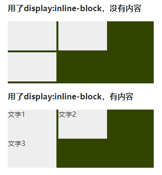

# 关于`display: inline-block`产生的间隙
## 想法
最近在看自己笔记的时候，看到了关于`display: inline-block`产生的间隙的记录，就简单的记录了一下，自己完全不能回忆起来。随即在网上搜了一下，相关的博客也是蛮多的，但里面的讲解不太符合个人的理解方式，还是自己回顾详细记录一下。
## 约定
以下所有的示例基于的html结构如下：
```html
  <ul>
    <li></li>
    <li></li>
    <li></li>
  </ul>
```
这里对不同内核浏览器进行了验证，并没有对所有的浏览器进行验证。

## 现象
在比较早的时候，不少的布局是用`float`属性完成。随着标准和浏览器的不断更新，布局的方式变多，原本目的不是用来布局的`float`属性，逐渐不被提倡使用。例如比较常见的横向排列布局，就可以利用`display: inline-block`的特性进行完成。但这个方式有一种问题：会出现间隙，间隙在水平和竖直方向都有。
如下图所示。


## 原因
先来了解这个属性值的含义，`display`值为`inline-block`会导致一个元素生成偏内联级别特性的块容器，这个元素的内部被格式化为块级盒子，元素本身被格式化为一个单独的内联级别盒子。也可以说这样的元素，既有块级元素的特性，又有内联元素的特性。一些教程里面翻译过来叫行内块元素，这个标准属性是在CSS2.1中才出现，但ie在很早的时候就实现了自己的inline-block。

从网上查询得知空隙是由空白符（white space）造成。那么在CSS里面什么是空白符？查询资料得知，在资源里面的换行的呈现，可能是一个回车符（），一个换行符，或者由回车符和换行符的组合，或者是其它的识别文档的开始和结束的部分机制。CSS属性`white-space`处理模型假定所有的换行已经被标准化为换行符。用户代理识别的换行表现必须要应用属性值为`normal`空白符处理规则。如果文档语言没有特定的换行规则，那么文档文本中的每个回车符和连续的回车换行符，都处理为一个换行符。默认的标准规则也会应用生成内容。

由以上就可以知道，在写html代码的时候，为了方便观看和维护，都用了适当的换行书写方式，而这些换行符，也将应用CSS属性`white-space`产生了内容，所以就产生了间隙。但上面的图片为什么在竖直方向上一个有间隙，一个没有间隙？都是相同的html结构，只是其中一个有文本，怎么就会这样子。

根据前面的介绍，了解到应用`display: inline-block`后，元素就会按照内联元素进行摆放，内联元素的对齐方式由属性`vertical-align`决定，那么是不是这个导致的呢？

## 相关资料
- https://www.w3.org/TR/CSS22/visuren.html#x17
- https://www.w3.org/TR/CSS22/text.html#x12